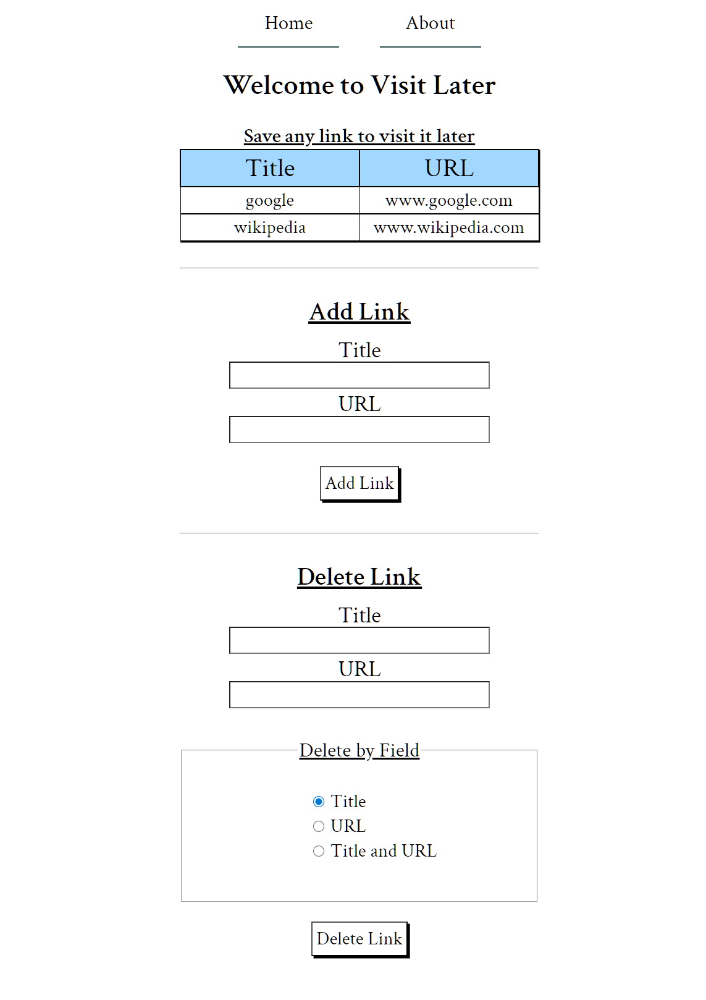

# Visit Later - A Flask website for QA practice
**Current app version:** `v0.0.5`
 ## What is this project about?
 **Visit Later** is a simple Flask web app for saving and deleting links to visit later.
 
  The app is intentionally kept simple and slightly imperfect to create realistic conditions for practicing QA workflows:
test planning, test design, cross-browser testing, test results tracking and bug reporting. 
 
 

## Recommended QA Docs - Showcase

- ### [Test Plan V2](tests/manual/1.%20STP/test_plan_v2.md) 
- ### [STD for v0.0.5-pre](tests/manual/2.%20STD/STD_v0.0.5-pre.md) 
- ### [STR for v0.0.5-pre](tests/manual/3.%20STR/STR_v0.0.5-pre.md) 
- ###  [BUG-009](tests/manual/bug_logs/BUG-009-add-link-Incorrect-missing-field-error.md), [BUG-013](tests/manual/bug_logs/BUG-013-All-Input-Fields-Max-character-limit-is-incorrect.md)

---

## App Spec
- ### [Visit Later Spec](spec/visit_later_spec.md)

## Features Tested
- UI visual elements
- Adding and deleting links
- Form validation
- Cross-browser behavior

---

## Testing Artifacts
All testing artifacts are stored in the `tests/manual/` directory.
- ### [Test Plans (STP) - `tests/manual/1. STP/`](tests/manual/1.%20STP/) 

- ### [Test Cases (STD) - `tests/manual/2. STD/`](tests/manual/2.%20STD/)

- ### [Test Reports (STR)  - `tests/manual/3. STR/`](tests/manual/3.%20STR/)

- ### [Bug Reports - `tests/manual/bug_logs/`](tests/manual/bug_logs/)

---

## Screenshots

